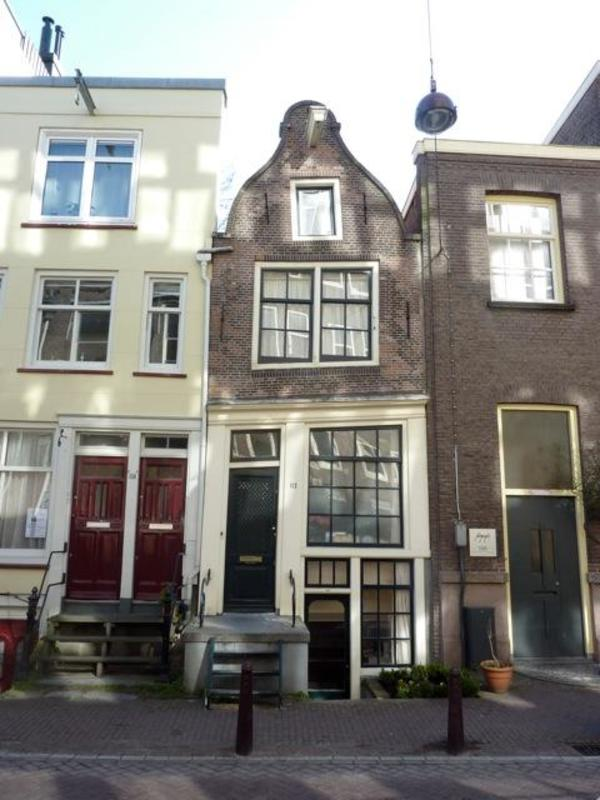

## Architecture, Front-End and a Bit of Front-End Architecture
Jan Hein Hoogstad   
offcourse.io   
@yeehaa
---
"Lisp isn’t a language, it’s a building material." —Alan Kay.
---
## Ethos = Accustomed Place
---

"A House Is Not A Home" -Burt Bacharach & Hal David
---

"Some Houses Are Homes" -Jan Hein Hoogstad
---
There is a relation between the building blocks and its use
---
"All that functional stuff, immutability, no side effects... I understand why this makes sense on the backend, but on the frontend..." -A Friend.
---
|Backend              |Frontend           |
|---------------------|-------------------|
|Complex              |Simple             |
|Core Product         |Marketing          |
|Long Term Investment |Temporary Artifact |
|Architecture Matters |Frameworks         |
---
## Frontend Frameworks

+ Lots of Documentation 
+ Quick To Get Started 
+ One Model Fits All
+ Limited Options to Customize

---
## Prefab Houses

---
"The oldest discovered bricks, originally made from shaped mud and dating before 7500 BC, were found at Tell Aswad, in the upper Tigris region and in southeast Anatolia close to Diyarbakir." -Wikipedia
---
## Crooked House

---
Architecture teaches us that there is strong connection between the history of building materials and the actual structures that are built. Introducing philosophers Walter Benjamin and Peter Sloterdijk’s thoughts on the influence of materials on the practice and theory of building, I will draw a parallel between historical buildings (such as the Sagrada Família and the Chrysler Building) and the way we build front-end applications. We will discuss how using different languages and techniques leads to different artifacts, and explore specific patterns and principles from back-end development that we can use to build better architected front-end software.

After my talk, attendees will know: why and how front-end structures become increasingly complex, what software designers can take from the history of architecture, and a set of principles from back-end and distributed architecture to introduce into front-end architecture

---
## Comparison

Pros and cons!

|Advantages|Disadvantages|
|----------|-------------|
|Big       |Heavy        |
|Efficent  |Slow         |
|Cheap     |Brittle      |
