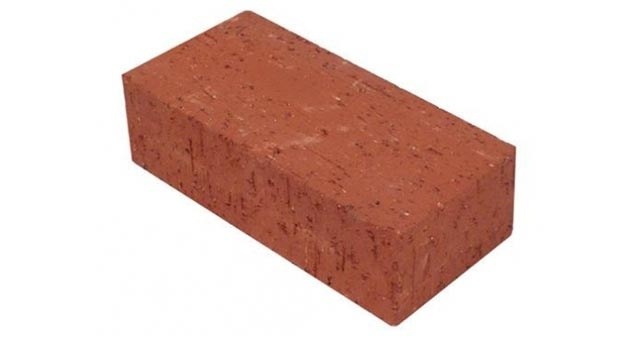
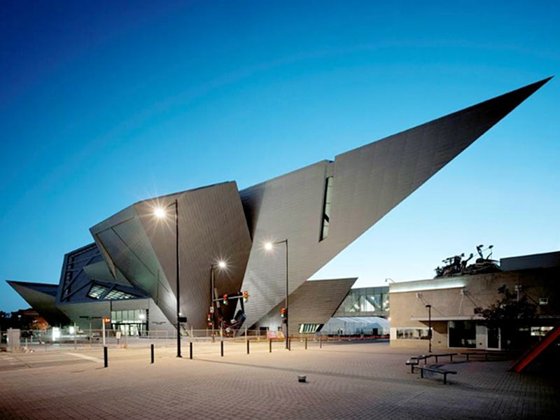
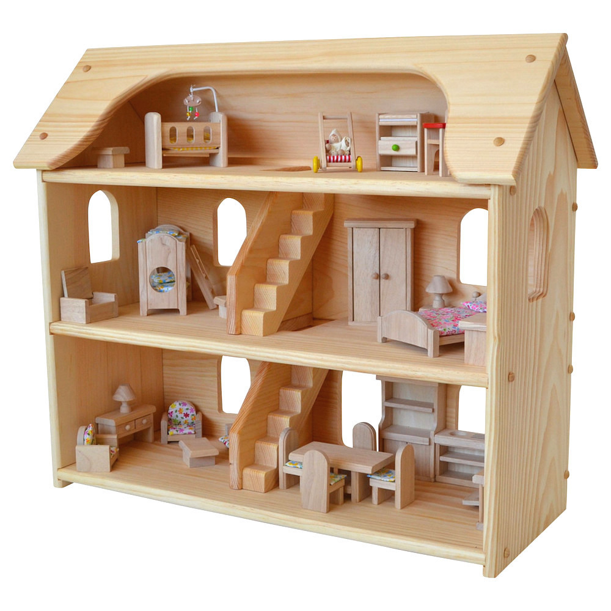
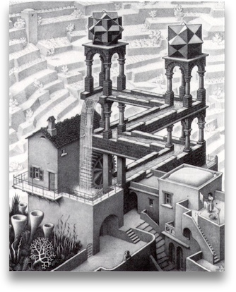
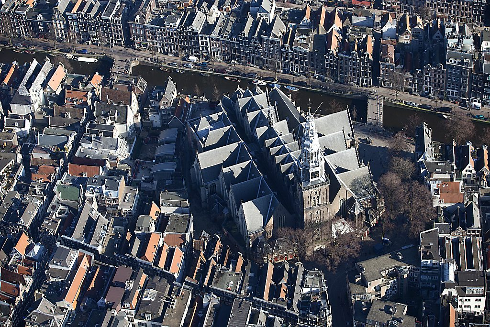
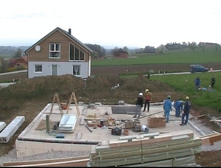
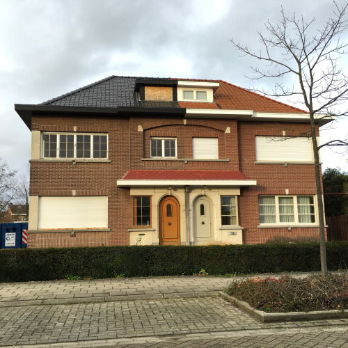
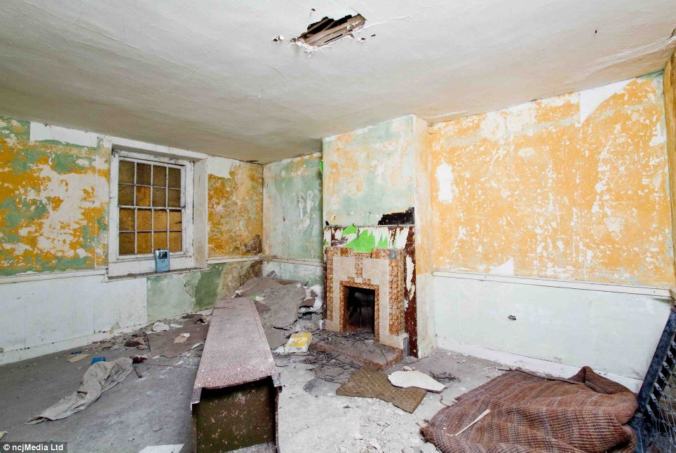

## Architecture, Frontend 
## and a Bit of Frontend Architecture
Jan Hein Hoogstad   
offcourse.io   
@yeehaa

<!---

Good morning everyone. Really excited to be here. I'm Jan Hein Hoogstad. In my previous life, I was a professor in philosophy and cultural studies. But nowadays, I am running a startup called Offcourse. Offcourse is going to radically change the way you learn new skills online, but that's not what I'm going to talk about today. Simply check out our website if you want to know more.

Instead, I will talk about buildings, actual buildings - houses, towers, bridges, etc. And I will talk about what they share with the constructions that we developers are building: programs, applications.

-->
---
"All that functional stuff, immutability, no side effects... I understand why this makes sense on the backend, but on the frontend..." 

—A Friend.

<!---

The inspiration for this presentation came from a comment that a good friend of mine made when I explained my choice of clojurescript as the language that I used for the offcourse frontend. I don't remember his exact words, but he said something along the lines of:  

"All that functional stuff, immutability, no side effects... I understand why this makes sense on the backend, but on the frontend..." 

What I found interesting about his remarks was not as much the content, but the assumptions about frontend development that were implied in his words.

Let me spell them out for you:

-->

---
## Assumptions

|Backend                |Frontend                     |
|---------------------  |-----------------------------|
|Complex                |Simple                       |
|Core Product           |Marketing                    |
|Long Term Investment   |Temporary Artifact           |
|Architectural Patterns |Whatever Works               |

<!---

The point of this presentation is too debunk all these assumptions about frontend architecture. It roughly consists of two parts:

-->

---
"Serverless" application architectures offer tremendous cost savings and colossal horizontal scaling ability, with the side benefit of encouraging loosely coupled design. The advantages are so profound, that the days of monolithic application servers might be numbered." 

—Obie Fernandez

<!--

The current transition towards so-called serverless architectures means that the frontend is becoming more and more important. Obie Fernandez, for instance, claims:

"Serverless" application architectures offer tremendous cost savings and colossal horizontal scaling ability, with the side benefit of encouraging loosely coupled design. The advantages are so profound, that the days of monolithic application servers might be numbered." 

Following this observation, seriously thinking about frontend architectures is therefore no longer a luxury but a must.
-->

---
"We shape our buildings; thereafter they shape us." 

—Winston Churchill

<!--

But the second, even more important reason is, that not thinking about architecture is a mistake under all circumstances. Here I'm in the company, not only of many famous architects but also statesmen like Winston Churchill who claimed that "We shape our buildings; thereafter they shape us."

-->

---
## Architecture
## Software and Architecture
## Frontend Architecture

<!---

This presentation consists of three parts. 

In the first, I will talk about architecture in general, how its use in software development is significally different from its physical counterpart, and why this matters.

In the second part, I will go through a some important design patterns and show what they look like as actual buildings

The last part, focusses on frontend architecture patterns in particular and how serverless changes everything.

-->

---
## Architecture

---

"Lisp isn’t a language, it’s a building material." 

—Alan Kay.

<!--- 

Alan Kay famously said that: "Lisp isn’t a language, it’s a building material." To me, this is exemplary of the way developers conceive architecture. We understand architecture in terms of the building blocks that we use, such as:

+ Languages
+ Abstractions
+ Libraries and Frameworks
+ Patterns

Although code reading groups are becoming more common, the actual artifacts that we produce - namely programs as programs - are still rarely discussed.

-->

---

"Architecture is not based on concrete and steel, and the elements of the soil. It's based on wonder." 

—Daniel Libeskind

<!---

Actual Architects tend to do the exact opposite. Daniel Libeskind for instance said that: 

"Architecture is not based on concrete and steel, and the elements of the soil. It's based on wonder." 

Although a bit too new-agey for me taste. It does clearly illustrate the way architects view their profession. To them, architecture is not about the building blocks that they use, but the lived spaces that emerge from these pieces.
-->

---

“Eiffel saw his Tower in the form of a serious object, rational, useful; men return it to him in the form of a great baroque dream which quite naturally touches on the borders of the irrational ... architecture is always dream and function, expression of a utopia and instrument of a convenience.” 

—Roland Barthes

<!---

Of course, leave it to the philosophers to go even a step further. Roland Barthes, for instance, said that:

“Eiffel saw his Tower in the form of a serious object, rational, useful; men return it to him in the form of a great baroque dream which quite naturally touches on the borders of the irrational ... architecture is always dream and function, expression of a utopia and instrument of a convenience.” 

To Barthes, architecture is also a expression of a future that can be, of could have been. 

-->

---

"Architecture starts when you carefully put two bricks together. There it begins." 

—Ludwig Mies van der Rohe

<!---

To sum this up: Architecture is three things at the same time:

1. Lived Spaces
2. An expression of a desired future
3. But, of course, it's also simply assemblage of building blocks.

Or, as the famous modernist architect Mies van der Rohe said: "Architecture starts when you carefully put two bricks together. There it begins." 

-->

---
## Software and Architecture

<!---

In the next section of this presentation, I will look at different software architecture patterns by comparing them to actual buildings.

-->

---

"In general, a particular system is defined in terms of a collection of components and interactions among those components." 

—Mary Shaw & David Garlan

<!---

When we talk about sofware architecture, we mostly talk about patterns i.e. how do the different components relate to each other. Mary Shaw and David Garlan for instance define software architecture as follows:

"In general, a particular system is defined in terms of a collection of components and interactions among those components." 

-->

---

"The main principle behind layered architectures is that of 'separation of responsibility'. Each layer is responsible for a finite amount of work."

—Jean Paul Boodhoo

<!---

The best known, and probably still most commonly used, software architecture pattern is the so-called layered architecture. 

"The main principle behind layered architectures is that of 'separation of responsibility'. Each layer is responsible for a finite amount of work."

This is comparable to classic house layout, as idealized in the dollhouse in the picture. Each floor has a clearly defined responsibility. The bottom layer is the living room, the middle the parent's bedroom, and the top one is where the baby sleeps.

In software development, a layered architecture can have many layers, but in its simplest form it consists of a persistence layer with business and presentation layers build on top of it.

-->

---

"Unfortunately, people using layered architectures can often run into a scenario where they introduce an unnecessary amount of coupling between layers of their application."

—Jean Paul Boodhoo

<!--

In practice, however, layered architectures often end up like the Escher print above. This is due to the fact that layered architectures usually end up highly coupled. As described in this quote:

"Unfortunately, people using layered architectures can often run into a scenario where they introduce an unnecessary amount of coupling between layers of their application."

Which results in fragile applications that are difficult to change or extend.

-->

---

"The Microkernel architectural pattern applies to software systems that must be able to adapt to changing system requirements."

—Dharmesh Sheta

<!--

The microkernel patters aims to correct the flaws of the layered architecture. This "architectural pattern applies to software systems that must be able to adapt to changing system requirements."

The 'Oude Kerk' in Amsterdam actually followed a very similar architectural pattern. First look at its original state...

-->

---

"It separates a minimal functional core from extended functionality and customer-specific parts. The microkernel also serves as a socket for plugging in these extensions and coordinating their collaboration."

—Dharmesh Sheta

<!--

And compare that to how it looks now.

This quote about the microkernel pattern equally applies to the architecture of the 'Oude Kerk':

"It separates a minimal functional core from extended functionality and customer-specific parts. The microkernel also serves as a socket for plugging in these extensions and coordinating their collaboration."

-->

---

<!---
microservices architecture
-->

---

---
## Frontend Architecture

---
"All that functional stuff, immutability, no side effects... I understand why this makes sense on the backend, but on the frontend..." 

—A Friend.

---
## Assumptions

|Backend                |Frontend                     |
|---------------------  |-----------------------------|
|Complex                |Complex                      |
|Core Product           |Core Product                 |
|Long Term Investment   |Long Term Investment         |
|Architectural Patterns |Architectural Patterns       |

---
## Ball of Mud Architecture
## Frameworks
## Serverless Architecture

---

"More Productive Out Of The Box." 

—Ember
    
<!---
## Advantages
+ Quick To Get Started 
+ One Model Fits All
-->

---

"Compromise makes a good umbrella, but a poor roof." 

—James Russell Lowell

<!---
## Disadvantages
+ Limited Options to Customize
-->

---
## Serverless Architecture

<!---
misnomer
-->

---
## Conclusion

---
<!---
Engineering is not a science. Science studies particular events to find general laws. Engineering design makes use of the laws to solve particular practical problems. In this it is more closely related to art or craft. –Ove Arup

-->

"A House Is Not A Home" 

—Burt Bacharach & Hal David

<!---

No one has summarized this clearer than the great philosophers Burt Bacharach and Hal David, when they used the voice of Dionne Warwick to claim that: "A House is Not a Home"
-->
