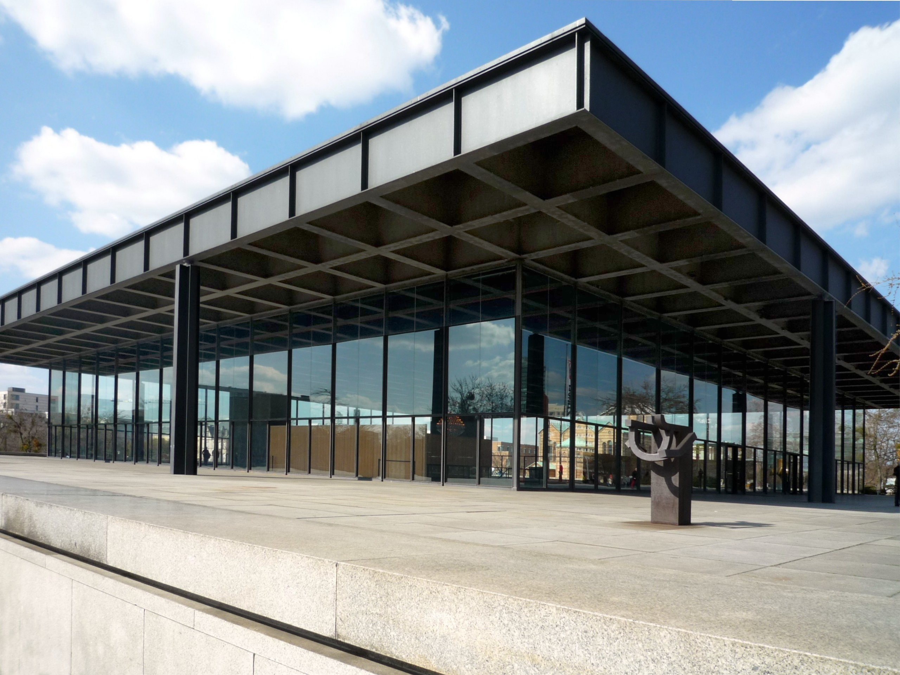

## Architecture, Frontend 
## and a Bit of Frontend Architecture
Jan Hein Hoogstad   
offcourse.io   
@yeehaa

<!---
Personal introduction and offcourse

Good morning everyone. Really excited to be here. My name is Jan Hein Hoogstad. I'm currently the CEO and lead developer of a startup called Offcourse. Offcourse is going to radically change the way we learn new skills online, but today, I'm not going to talk about that. 

In fact, for this presentation, my previous life as a professor in philosophy and cultural studies is probably equally relevant as my current one as a developer, since it combines insights from both.

-->
---
"All that functional stuff, immutability, no side effects... I understand why this makes sense on the backend, but on the frontend..." 

—A Friend.

<!---
The inspiration for this presentation came from a comment that a good friend made when I explained my choice of clojurescript as the language that I used for the offcourse frontend. He said something along the lines of: 

"All that functional stuff, immutability, no side effects... I understand why this makes sense on the backend, but on the frontend..." 

What I found interesting about his remarks was not as much the content, but the assumptions about frontend development that were implied in his words.
-->

---
## Assumptions

|Backend                |Frontend                     |
|---------------------  |-----------------------------|
|Complex                |Simple                       |
|Core Product           |Marketing                    |
|Long Term Investment   |Temporary Artifact           |
|Architectural Patterns |Whatever Works               |

<!---

The point of this presentation is too debunk all these assumptions about frontend architecture. It consists of two parts.

-->

---
"Serverless" application architectures offer tremendous cost savings and colossal horizontal scaling ability, with the side benefit of encouraging loosely coupled design. The advantages are so profound, that the days of monolithic application servers might be numbered." 

—Obie Fernandez

<!--
1. The current transition towards so-called serverless architectures, means that the frontend is becoming more and more important. Seriously thinking about frontend architectures is therefore no longer a luxury but a must.
-->

---
"We shape our buildings; thereafter they shape us." 

—Winston Churchill

<!--

2. Not thinking about architecture is a mistake under all circumstances. Here I'm in the company, not only of famous architects but also statesmen like Winston Churchill who claimed that "We shape our buildings; thereafter they shape us."
-->

---
## Architecture
## Software and Architecture
## Frontend Architecture

<!---
This presentation consists of three parts. 

In the first, I will talk about architecture in general, how its use in software development is significally different from its physical counterpart, and why this matters.

In the second part, I will go through a some important design patterns and show what they look like as actual buildings

The last part, focusses on frontend architecture in particular and why serverless changes everything.

---
## Architecture

---

"Lisp isn’t a language, it’s a building material." 

—Alan Kay.

<!--- 

+ We programmers mostly talk about architecture in terms of the building blocks that we use, but rarely about the actual artifacts that we produce. 

These building blocks can be:
+ Languages
+ Abstractions
+ Libraries and Frameworks
+ Patterns

-->

---

"Architecture is not based on concrete and steel, and the elements of the soil. It's based on wonder." 

—Daniel Libeskind

<!---

+ Actual Architects tend to do the exact opposite.
+ To them, architecture more about the lived spaces rather than the construction. 
+ In the case of software development, the lived space would be the actual program

-->

---

"A House Is Not A Home" 

—Burt Bacharach & Hal David

---

"Some Homes Are Houses" 

—Jan Hein Hoogstad

<!---

+ There is a relation between the building blocks and their use
+ In this presentation, I will look at different frontend architectures and the actual buildings that they would correspond to.

-->

---
## Architecture Patterns

---

"Architecture starts when you carefully put two bricks together. There it begins." 

—Ludwig Mies van der Rohe

---

"In general, a particular system is defined in terms of a collection of components and interactions among those components." 

—Mary Shaw & David Garlan

<!---

When we talk about sofware architecture, we mostly talk about patterns i.e. how do the different components relate to eachother

-->

---

"The main principle behind layered architectures is that of 'separation of responsibility'. Each layer is responsible for a finite amount of work."

—Jean Paul Boodhoo

<!---
Layered Architecture 2
-->

---

"Unfortunately, people using layered architectures can often run into a scenario where they introduce an unnecessary amount of coupling between layers of their application."

—Jean Paul Boodhoo

<!--
Layered Architecture 2

"A high degree of coupling is one factor that can lead to fragile application architectures that are difficult to change or extend."
-->

---

"The Microkernel architectural pattern applies to software systems that must be able to adapt to changing system requirements."

—Dharmesh Sheta

<!--
Microkernel Architecture 1
-->

---

"It separates a minimal functional core from extended functionality and customer-specific parts. The microkernel also serves as a socket for plugging in these extensions and coordinating their collaboration."

—Dharmesh Sheta

<!--
Microkernel Architecture 2
-->

---
<!---
microservices architecture
-->

---
## Frontend Architecture

---
"All that functional stuff, immutability, no side effects... I understand why this makes sense on the backend, but on the frontend..." 

—A Friend.

---
## Assumptions

|Backend                |Frontend                     |
|---------------------  |-----------------------------|
|Complex                |Simple                       |
|Core Product           |Marketing                    |
|Long Term Investment   |Temporary Artifact           |
|Architectural Patterns |Whatever Works               |

---
## Frameworks
## Sacrificial Architecture
## Serverless Architecture

---

"More Productive Out Of The Box." 

—Ember
    
<!---
## Advantages
+ Quick To Get Started 
+ One Model Fits All
-->

---

"Compromise makes a good umbrella, but a poor roof." 

—James Russell Lowell

<!---
## Disadvantages
+ Limited Options to Customize
-->

---

"So what does it mean to deliberately choose a sacrificial architecture? Essentially it means accepting now that in a few years time you'll (hopefully) need to throw away what you're currently building."

—Martin Fowler

---
## Serverless Architecture

<!---
misnomer
-->

---
## Offcourse Stack

+ react (rum - clojurescript)
+ lambda (clojurescript)
+ dynamodb
+ elastic search

<!---
merely bricks not that interesting. Architecture starts when you put these things together
-->

---
## Flow

cljs -> lambda -> dynamodb streams -> lambda -> es
cljs -> lambda -> es

<!--
+ high-level does not look that much different from a  traditional client-server stack, but this is misleading. 
+ Interesting part is that all elements are completely decoupled. 
+ In other words, a serverless architecture forces you to avoid unnecessary dependencies
-->

---
## Frontend

+ clojurescript
+ core.async
+ component
+ protocols and multimethods

<!--
With Offcourse we tried to bring a similar approach to the frontend.
-->

---
## Conclusion

Engineering is not a science. Science studies particular events to find general laws. Engineering design makes use of the laws to solve particular practical problems. In this it is more closely related to art or craft. –Ove Arup

<!---
“Eiffel saw his Tower in the form of a serious object, rational, useful; men return it to him in the form of a great baroque dream which quite naturally touches on the borders of the irrational ... architecture is always dream and function, expression of a utopia and instrument of a convenience.” 
-->
