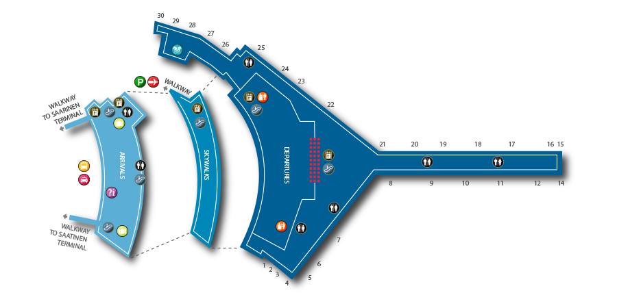

## Architecture, Frontend 
## and a Bit of Frontend Architecture
Jan Hein Hoogstad   
offcourse.io   
@yeehaa

<!---

Good morning everyone. Very excited to speak at this conference. My name is Jan Hein Hoogstad. In my previous life, I was a professor in philosophy and cultural studies. But that's all behind me. Nowadays, I'm running a startup called 'Offcourse'. 

Offcourse is going to radically change the way you learn new skills online, but that's not what this presentation is about. Please check out our website if you want to know more.

Today, I want to talk about buildings, actual buildings - houses, towers, bridges, etc. And I will discuss what these constructions share with the artifacts that we, developers, are creating: programs, libraries, and applications. They are all the product of architecture.

-->

---
"All that functional stuff, immutability, no side effects... I understand why this makes sense on the backend, but on the frontend..." 

—A Friend.

<!---

The inspiration for this presentation comes from a comment that a friend of mine made when I told him that I decided to use clojurescript as the language for the offcourse frontend application. While I cannot remember his words verbatim, it was something along the lines of:  

"All that functional stuff, immutability, no side effects... I understand why this makes sense on the backend, but on the frontend..." 

What fascinates me about his remark is not the content. It's the assumptions about frontend development that are implied in his words. Let me spell them out for you:

-->

---
|Backend                |Frontend                     |
|---------------------  |-----------------------------|
|Complex                |Simple                       |
|Core Product           |Marketing                    |
|Long Term Investment   |Temporary Artifact           |
|Architectural Patterns |Whatever Works               |

<!---

His comment suggests that:

The backend is complex, while the frontend is not.

The backend represents the core product, while the frontend is merely a by product, mainly used for marketing purposes.

Consequently, the frontend is just a temporary artifact while the backend should be a long term investment

And last but not least, that architectural patterns are only important on the  backend, while the frontend developer should simply use whatever works

In my experience, his opinion is not unique but quite representative of the developer community at large. My own views on frontend development, on the other hand, are diametrically opposed to these assumptions. I believe that architecture does matter tremendously on the frontend. Today more than ever. 

Before I go into detail, I want to briefly mention two reasons to support my views:

-->

---
"Serverless" application architectures offer tremendous cost savings and colossal horizontal scaling ability, with the side benefit of encouraging loosely coupled design. The advantages are so profound, that the days of monolithic application servers might be numbered." 

—Obie Fernandez

<!---

The current transition towards (unfortunately named) serverless architectures mean that the frontend, client, application is becoming more and more important. 

Obie Fernandez, for instance, claims that:

"Serverless" application architectures offer tremendous cost savings and colossal horizontal scaling ability, with the side benefit of encouraging loosely coupled design. The advantages are so profound, that the days of monolithic application servers might be numbered." 

Without a traditional backend, however, the client rather than the server is the place where all the different services come together. As a consequence, seriously thinking about frontend architecture is no longer a luxury. It has become an absolute must.

-->

---
"We shape our buildings; thereafter they shape us." 

—Winston Churchill

<!--

Personally, however, my primary reason for valuing proper design is a different one. I believe, that not thinking about architecture is a mistake under all circumstances. Here I'm in the company of a statesman like Winston Churchill who claimed that:

"We shape our buildings; thereafter they shape us."

Not thinking about the architecture of our programs means that we are shaped by implicit rather than explicit design choices.

-->

---
## Architecture
## Software and Architecture
## Frontend Architecture

<!---

This presentation consists of three parts:

In the first, I will talk about architecture in general, how its use in software development is significally different from its physical counterpart, and why this matters.

In the second part, I will go through a some important design patterns and show what they look like as actual buildings

The last part, focuses on common frontend architecture patterns and anti-patterns. And how we implemented a serverless architecture in clojurescript at Offcourse.

-->

---
## Architecture

---

"Lisp isn’t a language, it’s a building material." 

—Alan Kay.

<!--- 

Alan Kay famously said that: 

"Lisp isn’t a language, it’s a building material." 

To me, this is exemplary of the way we, developers, conceive architecture. We understand architecture in terms of the building blocks that we use, such as:

+ Languages
+ Abstractions
+ Libraries and Frameworks
+ Patterns

Although code reading groups - such as the awesome sounding classical code reading group - are becoming more common, the actual artifacts that we produce are still rarely discussed. We developers don't talk about programs like we chat about books or our favorite netflix shows. We cannot stop comparing languages, patterns, and libraries, but often forget to look at the actual product of these building blocks: the program as program. 

-->

---

"Architecture is not based on concrete and steel, and the elements of the soil. It's based on wonder." 

—Daniel Libeskind

<!---

Actual Architects tend to do the exact opposite. Daniel Libeskind for instance said that: 

"Architecture is not based on concrete and steel, and the elements of the soil. It's based on wonder." 

Although this quote is a bit too new-agey for my taste. It does clearly illustrate the way architects view their profession. To them, architecture does not deal with the building blocks that they use. They care about the constructions that emerge from these individual pieces.

-->

---

“Eiffel saw his Tower in the form of a serious object, rational, useful; men return it to him in the form of a great baroque dream which quite naturally touches on the borders of the irrational ... architecture is always dream and function, expression of a utopia and instrument of a convenience.” 

—Roland Barthes

<!---

Leave it to the philosophers to go even a step further. Roland Barthes, for instance, said that:

“Eiffel saw his Tower in the form of a serious object, rational, useful; men return it to him in the form of a great baroque dream which quite naturally touches on the borders of the irrational ... architecture is always dream and function, expression of a utopia and instrument of a convenience.” 

To put this simply, architecture is always a expression of a future that can be, of could have been. It's the materialization of common ideals. 

-->

---
"Ethos"

—Aristotle

<!-- 

Architecture is what Aristotle called an ethos. which literally means 'accustomed space'

-->

---

"A House Is Not A Home" 

—Burt Bacharach & Hal David

<!---

Aristotle's great successors Burt Bacharach and Hal David translated this into the easy to understand fact: "A House is Not a Home"

-->

---

"Architecture starts when you carefully put two bricks together. There it begins." 

—Ludwig Mies van der Rohe

---
1. Lived Space
2. Construction 
3. Bricks and Mortar

<!---

To sum this section up: Architecture is actually three things at once:

It is a material representation of a desired future, an expression of a set of ideals, a lived space, an ethos, a home

Architecture is also a technical construction. A feat of engineering. The product of many though choices.

But, architecture is also a simple collection of building blocks. Or, as the famous modernist architect Mies van der Rohe said: "Architecture starts when you carefully put two bricks together. There it begins." 

-->

---
## Software and Architecture

<!---

In the next section of this presentation, I will look at different software architecture patterns by comparing them to actual buildings.

-->

---

"The main principle behind layered architectures is that of 'separation of responsibility'. Each layer is responsible for a finite amount of work."

—Jean Paul Boodhoo

<!---

The best known, and probably still most commonly used, software architecture pattern is the so-called layered architecture. 

"The main principle behind layered architectures is that of 'separation of responsibility'. Each layer is responsible for a finite amount of work."

This is comparable to the classic home layout, as idealized in the dollhouse in the picture on this slide. In this house, each floor has a clearly defined responsibility. The bottom layer consists of the living room, the middle is the parent's bedroom, and the top one is where the baby sleeps.

In software development, a layered architecture can have many layers, but in its simplest form it consists of a persistence layer with business and presentation layers build on top of it.

-->

---

"Unfortunately, people using layered architectures can often run into a scenario where they introduce an unnecessary amount of coupling between layers of their application."

—Jean Paul Boodhoo

<!--

In practice, however, layered architectures often end up like this Escher print. This is due to the fact that the theoretically, clearly defined layers of such an architecture can easily get mixed up.

(and yes, I'm looking at you Ruby on Rails)

"Unfortunately, people using layered architectures can often run into a scenario where they introduce an unnecessary amount of coupling between layers of their application."

As a result of this tight coupling, layered architectures are often hard to scale, reuse, or refactor.

-->

---

"The Microkernel architectural pattern applies to software systems that must be able to adapt to changing system requirements."

—Dharmesh Sheta

<!--

The microkernel patters aims to correct the flaws of the layered architecture.

"[This] architectural pattern applies to software systems that must be able to adapt to changing system requirements."

The kernel in the name refers to a hub-like core that can be extended by plugins or adapters. While this may not be a common pattern in real-world architecture, it is one of the oldest.

The 'Oude Kerk' in Amsterdam for instance was built using a very similar design pattern. This is best illustrated visually. First look at the church's original state around 1306.

-->

---

"It separates a minimal functional core from extended functionality and customer-specific parts. The microkernel also serves as a socket for plugging in these extensions and coordinating their collaboration."

—Dharmesh Sheta

<!--

And compare that to how it looks today. The core chuch of 1306 is still intact, but is hardly recognizable. Over time, it has been augmented by many small modules that each extend the original building with custom functionality, such as housing, catering, and - ironically - prostitution.

This quote about the microkernel pattern could equally apply to the architecture of the 'Oude Kerk':

"It separates a minimal functional core from extended functionality and customer-specific parts. The microkernel also serves as a socket for plugging in these extensions and coordinating their collaboration."

-->

---

"In short, the microservice architectural style is an approach to developing a single application as a suite of small services, each running in its own process and communicating with lightweight mechanisms, often an HTTP resource API."

—Martin Fowler

<!--

No presentation on software architecture in 2016 would be complete without a extensive discussion of everyone's current favorite: the microservices pattern. 

Martin Fowler defines it as such:

"... the microservice architectural style is an approach to developing a single application as a suite of small services, each running in its own process and communicating with lightweight mechanisms, often an HTTP resource API."

Just like most modern airports consist of separate terminals and other building that each serve a particular purpose. The microservices architecture loses the concept of a predefined whole.

In direct contrast to the microkernel architecture, microservices do not need a central hub to work properly. Each service functions independently as well as in conjunction with others.

-->

---
| Characteristics                | Solution                            |
|--------------------------------|-------------------------------------|
| Componentization               | Containers / Functions as a Service |
| Smart Endpoints and Dumb Pipes | Messaging Bus                       |
| Design for Failure             | Asynchronous Coupling               |
| Evolutionary Design            | Continuous Deployment Pipeline      |

<!---

Although, the microservices architectures are not as uniform as the others, they do have a couple of shared characteristics.

The first is that the business logic of an application is distributed over multiple components. Each of these components has it's own clearly defined domain and gets deployed individually. This usually happens in the form of a Docker Container, or - ever more frequently - an AWS Lambda function.

These individual components communicate with each other through a message broker - zeromq or rabbitmq for instance. This marks the second characteristic: of a microservices architecture: 'smart endpoints and dumb pipes'. I will come back to this in a second.

Furthermore, microservices should be designed for failure. The way to accomplish this is to avoid synchronous coupling between the components as much as possible. Instead, the components only communicate via the aforementioned messaging pipeline. This also allows for replica's and backup services in case one of the individual services fails.

Lastly, microservices are characterized by an evolutionary design. They are commonly part of a continuous deployment pipeline. As a result, developers can roll out individual features one at a time, rather than fitting them in periodical release cycles.

-->

---

"The microservice community favours an alternative approach: smart endpoints and dumb pipes. Applications built from microservices aim to be as decoupled and as cohesive as possible - they own their own domain logic and act more as filters in the classical Unix sense - receiving a request, applying logic as appropriate and producing a response."

—Martin Fowler

<!--

Before I move on to the frontend, I want to focus on the 'Smart Endpoints, Dumb Pipes'. To me, this mark the core of the microservices pattern. 

Martin Fowler describes this it as follows:

"The microservice community favours an alternative approach: smart endpoints and dumb pipes. Applications built from microservices aim to be as decoupled and as cohesive as possible - they own their own domain logic and act more as filters in the classical Unix sense - receiving a request, applying logic as appropriate and producing a response."

This flow should be instantly recognizable to any functional programmers. In a microserver architecture. Each service basically works as a function, with clear inputs and outputs. (unfortunately the airport terminal in the schema pictured here is an impure function...) A microservices architecture and functional programming are therefore a natural fit.

-->
---

"Engineering is not a science. Science studies particular events to find general laws. Engineering design makes use of the laws to solve particular practical problems. In this it is more closely related to art or craft."

—Ove Arup

<!---

To me, the appeal of a microservices architecture lies in the fact that it encourages a developer to think about her specific domain. As opposed to all other patterns that I have discussed, this one does not try to force the domain knowledge to fit the architecture, but vice versa. A properly executed microservices architecture values good design. 

Or as the architect Ove Arup puts it:

"Engineering is not a science. Science studies particular events to find general laws. Engineering design makes use of the laws to solve particular practical problems. In this it is more closely related to art or craft."

-->

---
## Frontend Architecture

---
"All that functional stuff, immutability, no side effects... I understand why this makes sense on the backend, but on the frontend..." 

—A Friend.

<!---

From well-designed architectures, it's only a tiny step back to my friend's initial objection:

"All that functional stuff, immutability, no side effects... I understand why this makes sense on the backend, but on the frontend..." 

By now, I have hopefully convinced you that it's important to think about architecture in general. But I haven't explained why and how this applies to the frontend.

My answer will be a simple one. Serverless frontends should be shaped after a microservices architecture. Even though the code will probably run on a single client, rather than on distributed servers, I still consider it valuable to design the application as if it's a collection of services.

Before I explain the what and how of the serverless frontend architecture that we use at offcourse, I want to discuss some common alternatives.

1. Shantytown Architecture
2. Frameworks

-->

---

---
"Too many of our software systems are, architecturally, little more than shantytowns. Investment in tools and infrastructure is often inadequate and the tools that are used are primitive. Parts of the system grow unchecked, and the lack of architecture and planning allows problems in one part of the system to erode and pollute adjacent portions. Deadlines loom like monsoons, and architectural elegance seems unattainable."

—Brian Foote and Joseph Yoder

<!---

Unfortunately, the lack of any deliberate architecture is still prominent on the frontend. This anti-pattern has many names: shantytown, big ball of mud, but on the frontend it is best known as jquery Spaghetti. Brian Foote and Joseph Yoder vividly describe the dangers of such an approach:

"Too many of our software systems are, architecturally, little more than shantytowns. Investment in tools and infrastructure is often inadequate and the tools that are used are primitive. Parts of the system grow unchecked, and the lack of architecture and planning allows problems in one part of the system to erode and pollute adjacent portions. Deadlines loom like monsoons, and architectural elegance seems unattainable."

-->
---

"Why don't you use a framework instead?"

—Same Friend
    
<!---

So how do we clean up this shantytown, this big ball of mud, this jquery spaghetti... My friend had the solution:

"Why don't you use a javascript framework instead?"

At first glance, frontend frameworks have a lot of advantages. Like the slogan for the Ember framework states. They make the coder more productive out of the box. Furthermore, frameworks also replace the law of the jungle that characterizes the shantytown architecture with conventions and best practices. In short, frameworks are the software equivalent to prefab houses.

-->

---

"Compromise makes a good umbrella, but a poor roof." 

—James Russell Lowell

<!---

Unfortunately, frameworks also suffer from the same flaws as prefab houses. In the words of James Russell Lowell: 

"Compromise makes a good umbrella, but a poor roof." 

Frameworks are a 'one size fits all' solution. They may help you to get started quickly, but often make it difficult to scale and customize later on.

(and yes, I'm looking at you Angular)

While I have nothing against frameworks - like I said, some of my best friends use them - I would argue that they have little to do with architecture. Architecture is the art of about designing specific solutions for specific problems, To make spaces livable for the individual users. Framework tend to do the opposite.

-->
---
| Serverless Frontend                 | Clojurescript                       |
|-------------------------------------|-------------------------------------|
| Componentization                    | Component                           |
| Smart Endpoints and Dumb Pipes      | Core.Async Channels                 |
| Design for Failure                  | Core.Async Go Blocks                |
| Evolutionary Design                 | Build Artifact Plain HTML/CSS/JS    |

<!---

So with Offcourse, I chose to go a different route and designed a custom serverless frontend. This design based around the same principles as a microservices architecture. Clojurescript proved to be a fitting choice, because it provided me with the right set of primitives to implement the characteristics of this pattern, not to mimic the backend implementation on the frontend.

In our architecture, we use Stuart Sierra's creatively named 'Component' library to implement the services: common frontend services like a router, a datastore, and a view renderer that all function independently of each other.

Core.Async's channels are clojurescript's alternative to a message broker, while the go-block in the same library help us to prevent synchronous coupling between the different components.

Last but not least, the fact that clojurescript's build artifacts are simple javascript files, makes our deployment pipeline extremely simple. We just build, test and sync static websites.

-->

---
## Conclusion

---
1. Bricks and Mortar
2. Assemblage 
3. Lived Space

<!---

To wrap things up. In this presentation, I have showed that architecture - whether physical or virtual - consists of three perspectives on the same thing. It is:

... the blocks that the building consists of

... the construction that holds them together,

... and the set of ideals, practices and expectations that this assemblage expresses

-->

---

"A House Is Not A Home" 

—Burt Bacharach & Hal David

<!---

In short:

"A House Is Not A Home" 

But even though I completely agree with Bacharach and David, I would just like to add one tiny thing...

-->

---

"All Homes Are Also Houses"

—Jan Hein Hoogstad

<!---

Thanks for listening to me. Go out and build beautiful buildings...

---
### offcourse.io  
### @yeehaa  
offcourse.github.io/presentation-moonconf/
github.com/yeehaa123/presentation-moonconf/blob/master/slides.md
